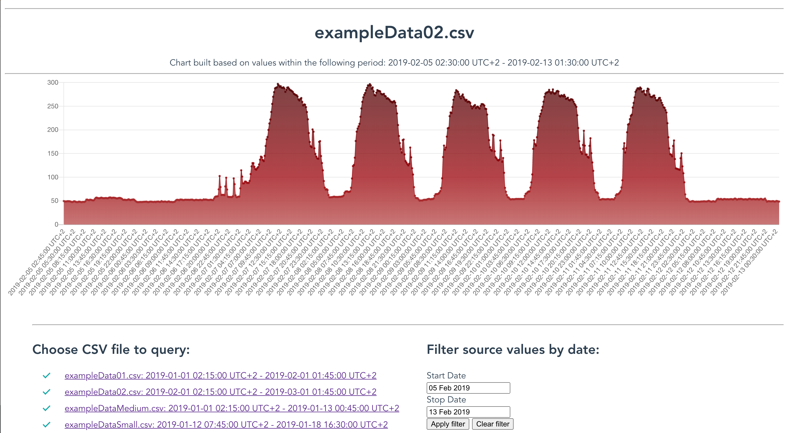

# grpc-csv-viewer
Prototype of gRPC service acquiring and serving data from CSV files as JSON formatted values

## CI Status: <a href="https://github.com/toorosan/grpc-csv-viewer"></a> <a href="https://github.com/toorosan/grpc-csv-viewer"></a>

## API specifications
- Client-side REST API: [raml/api.raml](raml/api.raml)
- gRPC protocol definition: [internal/pkg/csvviewer/csv_viewer.proto](internal/pkg/csvviewer/csv_viewer.proto)

## Run project
#### Requirements: cmake + docker + docker-compose.
#### To Run everything in docker containers:
- Run `> make run` - to serve example `.csv` files from [misc/csv_files](misc/csv_files) dir.
- To define specific directory with `.csv` files, specify it in environment variable `CSV_FOLDER`.
<br>E.g. `> CCSV_FOLDER="../internal/pkg/csvreader/test_data/" make run`
- When all components will be started, check UI on [http://127.0.0.1:8888](http://127.0.0.1:8888)
<br><a href="misc/ui-example.png"></a>
##### Notes about Docker environment organization:
- UI and Client are communicating via nginx on [http://127.0.0.1:8888](http://127.0.0.1:8888)
- gRPC Client is running on [http://127.0.0.1:8081](http://127.0.0.1:8081)
- gRPC Server is running on [http://127.0.0.1:8082](http://127.0.0.1:8082)
- Inter-service rRPC communications are working inside Docker isolated network.
<br>So both ports above are exposed only for development and debugging purposes


## Development
- All changes should be done in individual branches and then merged to master branch via pull request.
- Before creating a pull request, please make sure `make lint` is successful for the code in question.


#### To rebuild docker images and containers (convenient method after some source files were updated):
  ```make rebuild```

#### To regenerate protobuf interfaces:
  ```make regen-protobuf```

## Initial project requirements:
- Monorepo should contain the following components:
- gRPC server, serving time-based numeric data from CSV files as TimeSeries.
- gRPC client, requesting TimeSeries from gRPC server and responding it as JSON.
- Single page WEB application, requesting gRPC client and drawing chart based on TimeSeries.

## Basic sequence diagram:

<details>
  <summary>UML sources</summary>

```
@startuml gRPC proto
    actor Browser
        ServiceInitiator -> gRPCClient **: Initialization, \nacquire configuration \nwith gPRC address
        note left: gRPC client initialization
        activate gRPCClient
        gRPCClient -> gRPCClient : Start serving \n/index.html for \nHTTP GET requests
        gRPCClient -> gRPCClient : Start serving \n/timeseries for \nHTTP GET requests
        return Service initialized successfully

    loop while  "gRPC client available only"
        Browser -> gRPCClient : HTTP GET /
        activate gRPCClient
        return Respond with index.html
        'UI <- gRPCClient : GET /index.html
        Browser -> UI ** : Compile and prepare WEB UI
        activate UI
        UI -> gRPCClient: HTTP GET /timeseries
        activate gRPCClient
        gRPCClient --> gRPCServer: gRPC request, \nfailed as server is \nnot available
        return HTTP error 502 \nBad Gateway
        return Error: gRPC server is not available
    end
        ServiceInitiator -> gRPCServer ** : Initialization, \nacquire configuration \nwith CSV file location
        note left: gRPC server initialization
        activate gRPCServer
        gRPCServer -> gRPCServer : Index CSV file
        gRPCServer -> gRPCServer : Start serving gRPC requests
        return Service initialized successfully
    loop while "gRPCServer and gRPCClient are active"
        Browser -> gRPCClient : HTTP GET /
        activate gRPCClient
        return Respond with index.html
        'UI <- gRPCClient : GET /index.html
        Browser -> UI ** : Compile and prepare WEB UI
        activate UI
        UI -> gRPCClient: HTTP GET /timeseries
        activate gRPCClient
        gRPCClient -> gRPCServer: gRPC request
        activate gRPCServer
        gRPCServer -> gRPCServer: Read dataset \nfrom CSV file
        gRPCServer -> gRPCServer: Convert dataset \nto TimeSeries
        return gRPC Respond with TimeSeries
        return HTTP respond with \nTimeSeries JSON
        return Show TimeSeries chart
    end
    ...
    Browser -> UI !! : Close page with \nWEB application
@enduml
```
</details>
