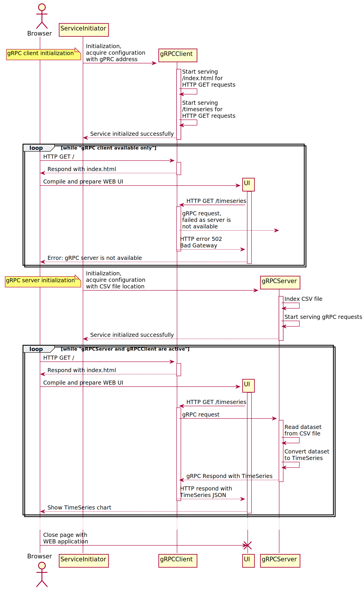

# grpc-csv-viewer
Prototype of gRPC service acquiring and serving data from CSV files as JSON formatted values

## CI Status: <a href="https://github.com/toorosan/grpc-csv-viewer"></a> <a href="https://github.com/toorosan/grpc-csv-viewer"></a>

## Run project
#### Requirements: cmake + docker + docker-compose.
#### Run everything in docker containers:
  ```make run-everything```
- All components are working behing nginx on http://127.0.0.1:8888
- Pure WEB UI is running on http://127.0.0.1:8080
- gRPC Client is running on http://127.0.0.1:8081
- gRPC Server is running on http://127.0.0.1:8082

#### Run with force rebuild docker images (convenient method after source files were updated):
  ```make run-everything-rebuilt```

## Project Requirements:
- Monorepo should contain the following components:
- gRPC server, serving time-based numeric data from CSV files as TimeSeries.
- gRPC client, requesting TimeSeries from gRPC server and responding it as JSON.
- Single page WEB application, requesting gRPC client and drawing chart based on TimeSeries.

## Basic sequense diagram:

<details>
  <summary>UML sources</summary>

```
@startuml gRPC proto
    actor Browser
        ServiceInitiator -> gRPCClient **: Initialization, \nacquire configuration \nwith gPRC address
        note left: gRPC client initialization
        activate gRPCClient
        gRPCClient -> gRPCClient : Start serving \n/index.html for \nHTTP GET requests
        gRPCClient -> gRPCClient : Start serving \n/timeseries for \nHTTP GET requests
        return Service initialized successfully

    loop while  "gRPC client available only"
        Browser -> gRPCClient : HTTP GET /
        activate gRPCClient
        return Respond with index.html
        'UI <- gRPCClient : GET /index.html
        Browser -> UI ** : Compile and prepare WEB UI
        activate UI
        UI -> gRPCClient: HTTP GET /timeseries
        activate gRPCClient
        gRPCClient --> gRPCServer: gRPC request, \nfailed as server is \nnot available
        return HTTP error 502 \nBad Gateway
        return Error: gRPC server is not available
    end
        ServiceInitiator -> gRPCServer ** : Initialization, \nacquire configuration \nwith CSV file location
        note left: gRPC server initialization
        activate gRPCServer
        gRPCServer -> gRPCServer : Index CSV file
        gRPCServer -> gRPCServer : Start serving gRPC requests
        return Service initialized successfully
    loop while "gRPCServer and gRPCClient are active"
        Browser -> gRPCClient : HTTP GET /
        activate gRPCClient
        return Respond with index.html
        'UI <- gRPCClient : GET /index.html
        Browser -> UI ** : Compile and prepare WEB UI
        activate UI
        UI -> gRPCClient: HTTP GET /timeseries
        activate gRPCClient
        gRPCClient -> gRPCServer: gRPC request
        activate gRPCServer
        gRPCServer -> gRPCServer: Read dataset \nfrom CSV file
        gRPCServer -> gRPCServer: Convert dataset \nto TimeSeries
        return gRPC Respond with TimeSeries
        return HTTP respond with \nTimeSeries JSON
        return Show TimeSeries chart
    end
    ...
    Browser -> UI !! : Close page with \nWEB application
@enduml
```
</details>
